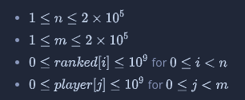

An arcade game player wants to climb to the top of the leaderboard and track their ranking. The game uses Dense Ranking, so its leaderboard works like this:

The player with the highest score is ranked number  on the leaderboard.
Players who have equal scores receive the same ranking number, and the next player(s) receive the immediately following ranking number.
Example

The ranked players will have ranks , , , and , respectively. If the player's scores are ,  and , their rankings after each game are ,  and . Return .

Function Description

Complete the climbingLeaderboard function in the editor below.

climbingLeaderboard has the following parameter(s):

int ranked[n]: the leaderboard scores
int player[m]: the player's scores
Returns

int[m]: the player's rank after each new score
Input Format

The first line contains an integer , the number of players on the leaderboard.
The next line contains  space-separated integers , the leaderboard scores in decreasing order.
The next line contains an integer, , the number games the player plays.
The last line contains  space-separated integers , the game scores.

Constraints

for
for
The existing leaderboard, , is in descending order.
The player's scores, , are in ascending order.
Subtask

For  of the maximum score:

1 <= n <= 200

1 <= m <= 200